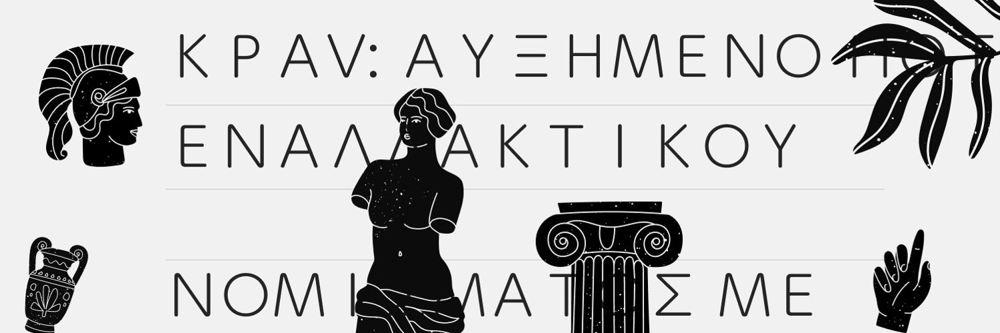

# KravTrade Solana Launchpad

[](https://x.com/kravtrade)
[](https://opensource.org/licenses/MIT)
[](https://www.rust-lang.org)
[](https://solana.com)
[](https://www.anchor-lang.com)

> 🚀 **A decentralized, secure, and feature-rich token launchpad built on Solana**

KravTrade Launchpad empowers projects to launch tokens with confidence while providing investors with secure participation mechanisms. Built with Anchor framework and following Solana best practices, our platform offers comprehensive presale management, flexible vesting schedules, and robust administrative controls.

## ✨ Why KravTrade Launchpad?

- 🔒 **Security First**: Audited smart contracts with comprehensive security measures
- 🎯 **Developer Friendly**: Complete TypeScript SDK with extensive documentation
- 🌐 **Community Driven**: Open source with active community contributions
- ⚡ **Solana Native**: Leverages Solana's speed and low transaction costs
- 🛡️ **Investor Protection**: Built-in refund mechanisms and secure escrow
- 🔧 **Highly Configurable**: Flexible parameters for diverse project needs

## 🚀 Key Features

| Feature | Description | Status |
|---------|-------------|--------|
| 🎯 **Token Launch Creation** | Create and configure token sales with customizable parameters | ✅ Ready |
| 🔐 **Secure Presales** | Manage fundraising campaigns with contribution limits and time windows | ✅ Ready |
| ⏰ **Vesting Schedules** | Time-locked token distribution with cliff periods and linear releases | ✅ Ready |
| 👥 **Administrative Controls** | Platform governance with approval workflows and emergency controls | ✅ Ready |
| 💰 **Fee Management** | Automated platform fee collection and fund distribution | ✅ Ready |
| 🛡️ **Investor Protection** | Refund mechanisms for failed launches and secure escrow | ✅ Ready |
| 📦 **TypeScript SDK** | Complete client library for easy integration | ✅ Ready |
| 🧪 **Comprehensive Testing** | Full test suite with unit and integration tests | ✅ Ready |

## 🏗️ Architecture

The launchpad consists of multiple interconnected components:

- **Launchpad Program**: Core functionality for launch creation and management
- **Token Integration**: SPL Token program integration for mint operations
- **Vesting System**: Time-locked token distribution mechanisms
- **Admin Controls**: Platform governance and administrative functions

### Key Components

- **Platform Configuration**: Global settings and fee structure
- **Launch Configuration**: Individual launch parameters and state
- **Investor Accounts**: User participation data and allocations
- **Vesting Accounts**: Time-locked token release schedules
- **Treasury Management**: Secure fund handling and fee collection

## 📋 Prerequisites

- [Rust](https://rustup.rs/) 1.70.0+
- [Solana CLI](https://docs.solana.com/cli/install-solana-cli-tools) 1.16.0+
- [Anchor Framework](https://www.anchor-lang.com/docs/installation) 0.29.0+
- [Node.js](https://nodejs.org/) 18.0.0+
- [Yarn](https://yarnpkg.com/) or npm

## 🛠️ Installation

1. **Clone the repository**
   ```bash
   git clone https://github.com/kravtrading/launchpad.git
   cd launchpad/contracts
   ```

2. **Install dependencies**
   ```bash
   yarn install
   # or
   npm install
   ```

3. **Build the program**
   ```bash
   anchor build
   ```

4. **Generate program keypair (if needed)**
   ```bash
   solana-keygen new -o target/deploy/kravtrade_launchpad-keypair.json
   ```

5. **Update program ID**
   ```bash
   anchor keys list
   # Update the program ID in Anchor.toml and lib.rs
   ```

## 🚀 Quick Start

### 1. Start Local Validator

```bash
solana-test-validator
```

### 2. Deploy to Localnet

```bash
# Build and deploy
anchor build
anchor deploy

# Initialize platform
npm run deploy:script deploy
```

### 3. Run Tests

```bash
# Run all tests
anchor test

# Run specific test file
anchor test --skip-deploy tests/kravtrade-launchpad.ts
```

### 4. Monitor Platform

```bash
# Generate health report
npm run monitor health

# Monitor specific launch
npm run monitor launch 1

# Start continuous monitoring
npm run monitor start
```

## 📖 Usage Examples

### Creating a Launch

```typescript
import { LaunchpadSDK } from './sdk/launchpad-sdk';
import { Connection, Keypair } from '@solana/web3.js';
import { BN } from '@coral-xyz/anchor';

// Initialize SDK
const connection = new Connection('http://127.0.0.1:8899');
const wallet = new Wallet(creatorKeypair);
const sdk = LaunchpadSDK.create(connection, wallet, {
  programId: new PublicKey('YOUR_PROGRAM_ID'),
});

// Create launch parameters
const launchParams = {
  launchId: new BN(1),
  name: "Example Token",
  symbol: "EXAMPLE",
  decimals: 9,
  totalSupply: new BN(1_000_000 * 10**9),
  presalePrice: new BN(0.1 * LAMPORTS_PER_SOL),
  minContribution: new BN(0.01 * LAMPORTS_PER_SOL),
  maxContribution: new BN(10 * LAMPORTS_PER_SOL),
  softCap: new BN(1 * LAMPORTS_PER_SOL),
  hardCap: new BN(10 * LAMPORTS_PER_SOL),
  startTime: new BN(Math.floor(Date.now() / 1000) + 3600),
  endTime: new BN(Math.floor(Date.now() / 1000) + 7 * 24 * 3600),
  vestingConfig: {
    cliffDuration: new BN(0),
    vestingDuration: new BN(30 * 24 * 3600),
    initialUnlockPercentage: 1000, // 10%
    isLinear: true,
  },
  metadata: {
    description: "Revolutionary DeFi token",
    website: "https://example.com",
    twitter: "@example",
    telegram: "https://t.me/example",

    logoUri: "https://example.com/logo.png",
    documentation: "https://docs.example.com",
  },
};

// Create the launch
const tokenMint = Keypair.generate();
const result = await sdk.createLaunch(launchParams, creatorKeypair, tokenMint);
console.log('Launch created:', result.signature);
```

### Contributing to a Launch

```typescript
// Contribute to launch
const contributionAmount = new BN(0.5 * LAMPORTS_PER_SOL);
const result = await sdk.contribute(
  new BN(1), // launch ID
  contributionAmount,
  investorKeypair
);
console.log('Contribution successful:', result.signature);
```

### Claiming Tokens

```typescript
// Claim vested tokens
const result = await sdk.claimTokens(
  new BN(1), // launch ID
  investorKeypair
);
console.log('Tokens claimed:', result.signature);
```

## 🧪 Testing

The project includes comprehensive tests covering:

- Platform initialization and configuration
- Launch creation and validation
- Investor contributions and limits
- Token claiming and vesting
- Administrative controls
- Error conditions and edge cases

### Running Tests

```bash
# Run all tests
anchor test

# Run with verbose output
anchor test --skip-deploy -- --reporter spec

# Run specific test suite
anchor test --skip-deploy tests/kravtrade-launchpad.ts
```

### Test Coverage

- ✅ Platform initialization
- ✅ Launch creation and approval
- ✅ Investor contributions
- ✅ Token claiming and vesting
- ✅ Refund mechanisms
- ✅ Administrative controls
- ✅ Error handling
- ✅ Security validations

## 🔧 Configuration

### Environment Configuration

Create configuration files for different environments:

**`config/localnet.json`**
```json
{
  "cluster": "localnet",
  "platformFeePercentage": 250,
  "minLaunchDuration": 86400,
  "maxLaunchDuration": 2592000,
  "minSoftCap": 1000000000
}
```

**`config/devnet.json`**
```json
{
  "cluster": "devnet",
  "platformFeePercentage": 250,
  "minLaunchDuration": 86400,
  "maxLaunchDuration": 2592000,
  "minSoftCap": 1000000000
}
```

### Deployment Configuration

Update `Anchor.toml` with your program IDs:

```toml
[programs.localnet]
kravtrade_launchpad = "YOUR_PROGRAM_ID"

[programs.devnet]
kravtrade_launchpad = "YOUR_PROGRAM_ID"

[programs.mainnet]
kravtrade_launchpad = "YOUR_PROGRAM_ID"
```

## 📚 Documentation

- [API Documentation](./docs/API.md) - Complete API reference
- [Architecture Guide](./docs/ARCHITECTURE.md) - System architecture overview
- [Security Guide](./docs/SECURITY.md) - Security considerations and best practices
- [Integration Guide](./docs/INTEGRATION.md) - How to integrate with the launchpad

## 🔐 Security

The launchpad implements multiple security measures:

- **Access Control**: Role-based permissions with proper authorization checks
- **Input Validation**: Comprehensive validation and sanitization
- **Arithmetic Safety**: Overflow protection for all calculations
- **Reentrancy Protection**: Secure state management
- **Time-based Security**: Validation of time-based operations
- **Fund Security**: Secure escrow mechanisms

### Security Audits

- [ ] Internal security review
- [ ] External security audit
- [ ] Bug bounty program

## 🚀 Deployment

### Local Development

```bash
# Start local validator
solana-test-validator

# Deploy to local
anchor build
anchor deploy
npm run deploy:script deploy
```

### Devnet Deployment

```bash
# Configure for devnet
solana config set --url devnet

# Deploy to devnet
CLUSTER=devnet anchor deploy
CLUSTER=devnet npm run deploy:script deploy
```

### Mainnet Deployment

```bash
# Configure for mainnet
solana config set --url mainnet-beta

# Deploy to mainnet (use with caution)
CLUSTER=mainnet anchor deploy
CLUSTER=mainnet npm run deploy:script deploy
```

## 📊 Monitoring

The platform includes comprehensive monitoring tools:

```bash
# Health check
npm run monitor health

# Monitor specific launch
npm run monitor launch <launch_id>

# Continuous monitoring
npm run monitor start
```

### Monitoring Features

- Platform health checks
- Launch activity monitoring
- Performance metrics
- Error tracking and alerting
- Automated reporting

## 🤝 Contributing

We ❤️ contributions from the community! Whether you're fixing bugs, adding features, or improving documentation, your help makes KravTrade Launchpad better for everyone.

### 🌟 Ways to Contribute

- 🐛 **Report Bugs**: Found an issue? [Open an issue](https://github.com/kravtrading/launchpad/issues/new?template=bug_report.md)
- 💡 **Feature Requests**: Have an idea? [Share it with us](https://github.com/kravtrading/launchpad/issues/new?template=feature_request.md)
- 📖 **Documentation**: Help improve our docs
- 🔧 **Code**: Submit pull requests for bug fixes or new features
- 🧪 **Testing**: Help us test new features and report issues

### 🚀 Quick Start for Contributors

1. **Fork & Clone**
   ```bash
   git clone https://github.com/YOUR_USERNAME/launchpad.git
   cd launchpad/contracts
   ```

2. **Set up Development Environment**
   ```bash
   # Install dependencies
   yarn install
   
   # Build the project
   anchor build
   
   # Run tests
   anchor test
   ```

3. **Create a Feature Branch**
   ```bash
   git checkout -b feature/amazing-feature
   ```

4. **Make Your Changes**
   - Follow our [coding standards](#code-style)
   - Add tests for new functionality
   - Update documentation as needed

5. **Submit a Pull Request**
   - Ensure all tests pass
   - Write a clear PR description
   - Link any related issues

### 📋 Code Style

- **Rust**: Follow [Rust API Guidelines](https://rust-lang.github.io/api-guidelines/)
- **TypeScript**: Use ESLint and Prettier configurations
- **Comments**: Write clear, concise comments in English
- **Testing**: Maintain >90% test coverage
- **Documentation**: Update docs for any public API changes

### 🏆 Contributors

Thanks to all our amazing contributors! 🎉

<!-- Contributors will be automatically added here -->

### 💬 Community

- 🐦 **Twitter**: [@kravtrade](https://x.com/kravtrade)
- 📧 **Email**: developers@krav.trading

## 📄 License

This project is licensed under the MIT License - see the [LICENSE](./LICENSE) file for details.

## 🆘 Support & Community

### 📚 Resources

- 📖 **[Documentation](./docs/)** - Comprehensive guides and API reference
- 🎯 **[Examples](./examples/)** - Real-world usage examples
- 🔧 **[Troubleshooting](./docs/TROUBLESHOOTING.md)** - Common issues and solutions
- 🛡️ **[Security](./docs/SECURITY.md)** - Security best practices

### 💬 Get Help

- 🐛 **Bug Reports**: [GitHub Issues](https://github.com/kravtrading/launchpad/issues)
- 💡 **Feature Requests**: [GitHub Discussions](https://github.com/kravtrading/launchpad/discussions)
- � **Direuct Support**: support@krav.trading

### 🌟 Stay Updated

- 🐦 **Follow us**: [@kravtrade](https://x.com/kravtrade)
- 📢 **Announcements**: [GitHub Releases](https://github.com/kravtrading/launchpad/releases)

## 🗺️ Roadmap

### ✅ Completed (v1.0)
- Core launchpad functionality
- Vesting mechanisms with cliff periods
- Administrative controls and governance
- TypeScript SDK with full type safety
- Comprehensive testing suite (>90% coverage)
- Security audits and best practices

### 🚧 In Progress (v1.1)
- [ ] Advanced vesting schedules (milestone-based, performance-based)
- [ ] Multi-token support for complex launches
- [ ] Enhanced analytics dashboard
- [ ] Mobile SDK for React Native

### 🔮 Future (v2.0+)
- [ ] Cross-chain bridge integration
- [ ] DAO governance token integration
- [ ] Advanced tokenomics templates
- [ ] Institutional investor features
- [ ] Automated market maker integration

### 🎯 Community Requests
Vote on features you'd like to see: [Feature Voting](https://github.com/kravtrading/launchpad/discussions/categories/feature-requests)

## 📊 Project Stats

<div align="center">


</div>

## ⚠️ Important Disclaimers

### 🔒 Security Notice
- This software is provided "as is" without warranty of any kind
- Always conduct thorough testing before deploying to mainnet
- Consider professional security audits for production use
- Never invest more than you can afford to lose

### 🧪 Development Status
- Currently in **active development** - APIs may change
- Mainnet deployment requires additional security considerations
- Community testing and feedback are highly encouraged

### 📜 Legal
- Use at your own risk and responsibility
- Comply with your local regulations regarding token launches
- This software does not constitute financial advice

## 🙏 Acknowledgments

We're grateful to the amazing open-source community and these fantastic projects:

- 🏗️ **[Anchor Framework](https://www.anchor-lang.com/)** - Making Solana development accessible
- ⚡ **[Solana Labs](https://solana.com/)** - The high-performance blockchain that powers us
- 🌐 **[SPL Token Program](https://spl.solana.com/)** - Standard token implementation
- 🔧 **[Metaplex](https://www.metaplex.com/)** - NFT and metadata standards
- 👥 **Solana Developer Community** - For continuous inspiration and support

### 🏆 Special Thanks

- All our [contributors](https://github.com/kravtrading/launchpad/graphs/contributors)
- Beta testers and early adopters
- Security researchers and auditors
- The broader DeFi and Solana ecosystem

---

<div align="center">

**Built with ❤️ by the KravTrade Community**

[Website](https://krav.trading) • [Twitter](https://x.com/kravtrade) • [Documentation](./docs/)

*Empowering the next generation of token launches on Solana* 🚀

</div>
